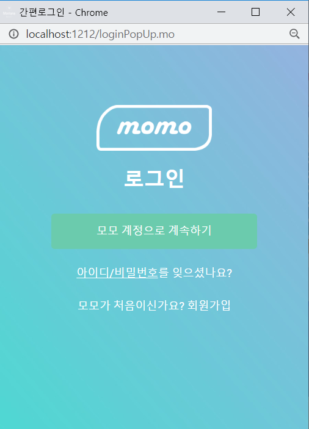
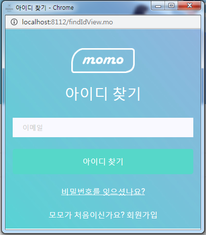
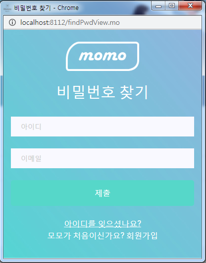
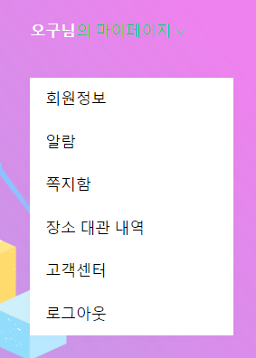
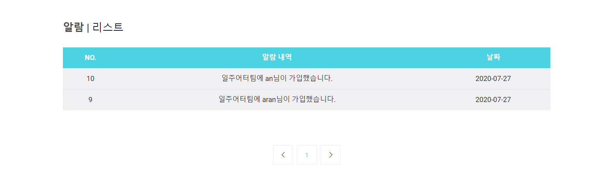
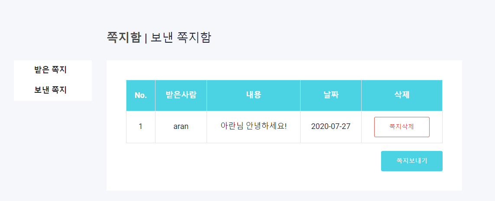
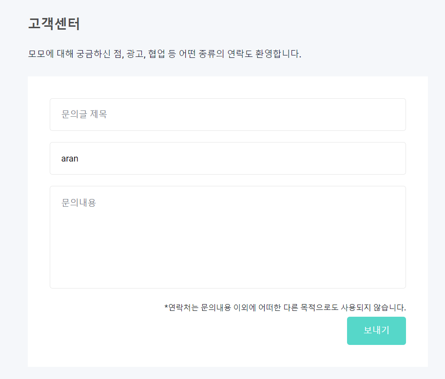
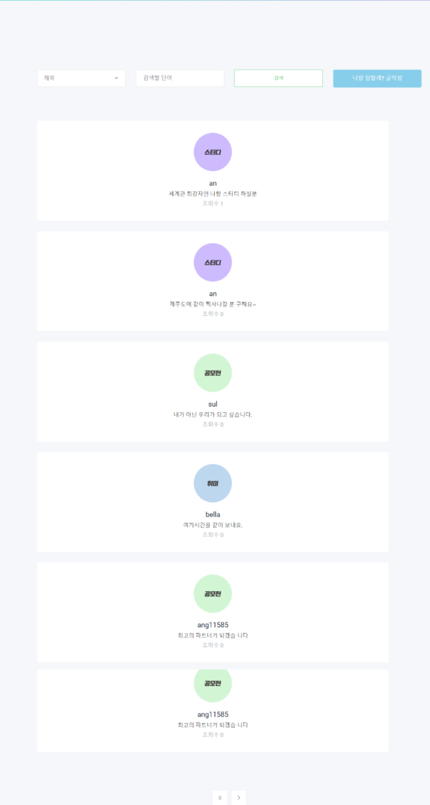
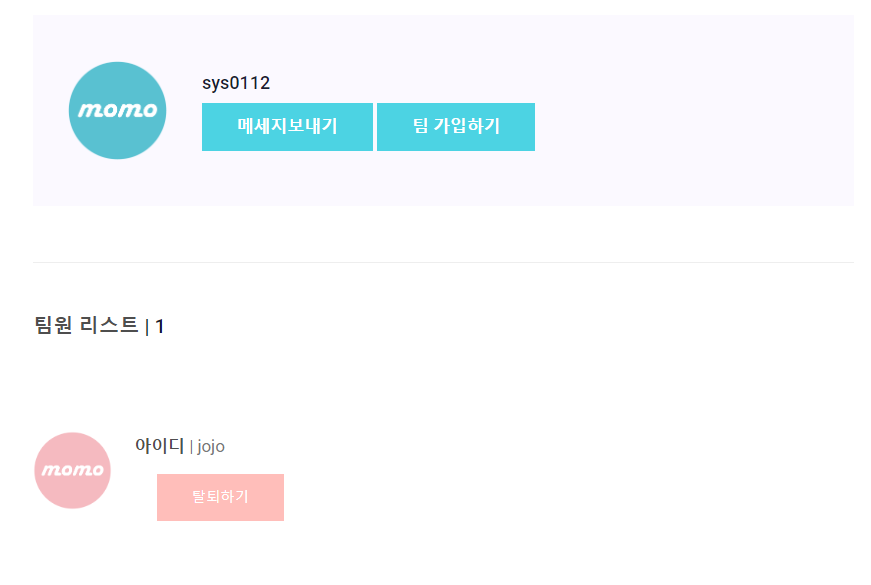
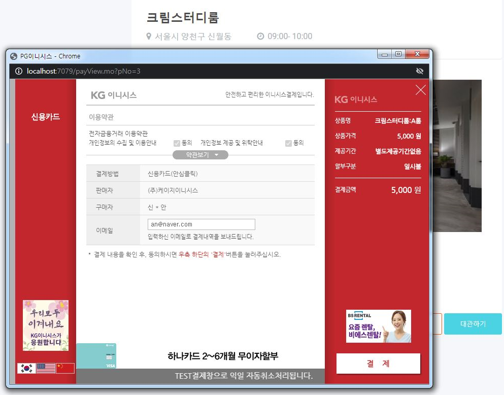

# MOMO
## 모모
**모두모여** 의 줄임말로 사용자가 좀 더 편하고 손쉽게 **팀빌딩** 서비스를 이용할 수 있도록 만든 사이트 
- 팀 빌딩(Team Building) : TEAM(조직)과 BUILDING(만들기)의 합성어

- 개발 목표 :
다양한 분야의 팀빌딩을 위한 팀빌딩 플랫폼 서비스 제작

## 구현 화면

- 로그인/회원가입

- 아이디 찾기/비밀번호 찾기

- 메인 페이지

- 마이 페이지

- 내 정보 수정

- 알람

- 쪽지함

- 장소 대관 내역

- 고객센터

- 나랑팀할래?

- 우리팀할래?

- 어디서볼래?

## 시연 영상
- [스펀딩 프로젝트](https://www.youtube.com/watch?v=6lJRiR4ETgY&feature=youtu.be)

## 개발 도구
- 이클립스
- 오라클
- HTML/CSS/JS
- jQuery
- Java
- Apache
- Spring Framework
